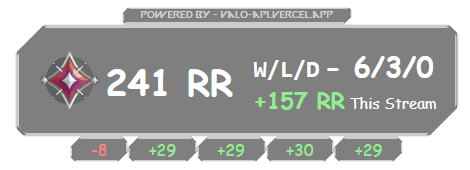
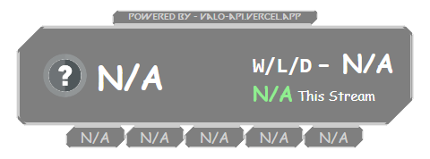
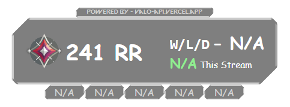

# Rank-Record Overlay

## [Base URL](../api-reference/overview.md/#base-url)

```plaintext
https://valo-api.vercel.app
```

## `/overlays/rank-record` Endpoint

### Description

The Rank-Record overlay provides information about the user's Valorant Rank and MMR history during the current stream. It calculates wins, losses, draws, and RR (Rank Rating) changes based on the stream's start time.

### HTTP Method

`GET`

### Endpoint

`/overlays/rank-record`

### Request Parameters

| Parameter | Type   | Description                                                                      | Example                                     |
| --------- | ------ | -------------------------------------------------------------------------------- | ------------------------------------------- |
| `channel` | String | The Twitch channel name of the streamer.                                         | `Streamer123`                               |
| `name`    | String | The in-game name of the Valorant player.                                         | `PlayerName`                                |
| `tag`     | String | The tagline associated with the player's in-game name, excluding the `#` symbol. | `1234`                                      |
| `region`  | String | The region of the player's Valorant account (e.g., `na`, `eu`).                  | `na`                                        |
| `apiKey`  | String | Your API key obtained from HenrikDev API                                         | `HDEV-xxxxxxxx-xxxx-xxxx-xxxx-xxxxxxxxxxxx` |

### Example Request

```plaintext
GET /overlays/rank-record?channel=Streamer123&name=PlayerName&tag=1234&region=na&apiKey=HDEV-xxxxxxxx-xxxx-xxxx-xxxx-xxxxxxxxxxxx
```

### Example Responses

- When the player's rank and record are available:



- When the player's rank and record are not available:



- When the player's rank is available but the record is not (when the stream isn't live):



### Overlay Setup

To add the Rank-Record overlay to your stream, follow these steps:

1. Create a new browser source in your streaming software (e.g., OBS Studio, StreamLabs OBS).
2. Set the URL of the browser source to `https://valo-api.vercel.app/overlays/rank-record?channel=<your-channel-name>&name=<your-in-game-name>&tag=<your-tag>&region=<your-region>&apiKey=HDEV-xxxxxxxx-xxxx-xxxx-xxxx-xxxxxxxxxxxx`.
3. Adjust the width and height of the browser source to fit your stream layout. (Recommended size: 800x600)
4. Position the overlay on your stream layout where you want it to appear.
5. Save the settings and start streaming!

### Additional Notes

- The Rank-Record overlay is designed to display the player's current rank and MMR history during the stream. It calculates wins, losses, draws, and RR (Rank Rating) changes based on the stream's start time.
- It also displays the player's mmr change in the last 5 matches at the bottom of the overlay. If no matches or less than 5 matches have been played, the overlay will display the mmr change only for the matches that have been played and the rest will be displayed as N/A.
- If the player's rank or record is not available, the overlay will display a message indicating that the data is not available.
- If the player's rr change is negative, it will be displayed in <span style= "color:tomato">red</span> to indicate a decrease in RR. Similarly, if the rr change is positive, it will be displayed in <span style="color:lightgreen">green</span> to indicate an increase in RR.
- The overlay is updated in real-time as the stream progresses, providing viewers with up-to-date information on the player's rank and performance. It may take a minute or two for the overlay to reflect changes after a match has ended.